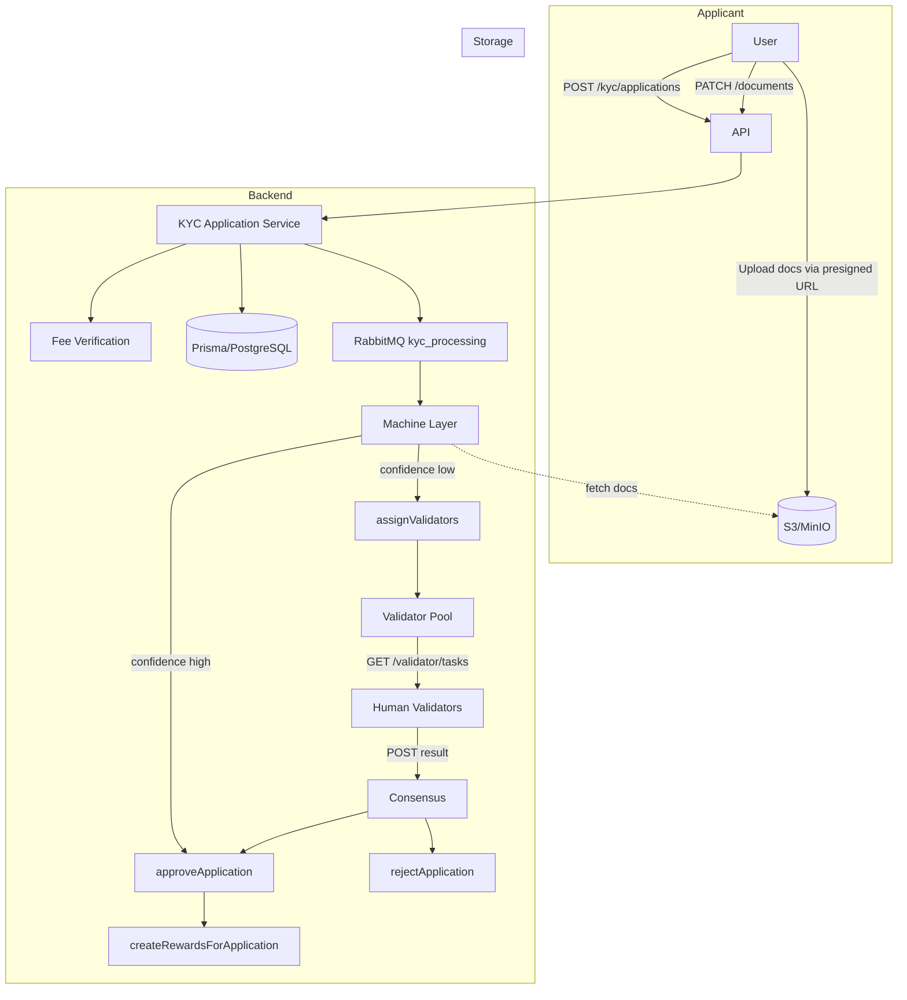

# Pi-Style KYC Layer

This document describes the KYC (Know Your Customer) layer built for ACBU, following the Pi Network model: machine automation plus a human validator pool, with privacy via redaction and ACBU-based fees and rewards.

---

## Overview

The layer does two things:

1. **Proves the user is a real person** using identity documents and optional selfie, without storing more PII than needed.
2. **Uses a two-step check**: an automated step (AI/OCR + redaction) and, when the machine is unsure, human validators from the same country who only see redacted data.

Fees and validator rewards use ACBU. **The KYC fee is paid by the user depositing local currency: we mint ACBU from that deposit, and that mint covers the fee.** The user passes the mint transaction id when creating the application. Alternatively, the fee can be paid by a direct Stellar payment to a collector address (`fee_tx_hash`).

---

## Architecture

- **Applicant**: deposits local currency → we mint ACBU → user creates KYC application with `mint_transaction_id` (or with `fee_tx_hash` if paying via Stellar). Then uploads documents and adds refs via PATCH.
- **Backend**: verifies fee (mint tx completed for this user with acbu_amount ≥ fee, or Stellar payment to collector), creates application, enqueues machine job. Machine extracts/redacts and either auto-approves or sends to validators. Validators see only redacted payload; consensus drives approve/reject. On approval, validator rewards are created.
- **Storage**: raw documents in S3/MinIO; DB holds only refs and metadata. Validators never get raw or extracted payloads.

---

## Data Model (Prisma)

All KYC tables live in `backend/prisma/schema.prisma`.

| Model | Role |
|-------|-----|
| **KycApplication** | One per user submission. Tracks `userId`, `countryCode`, `status` (`pending` \| `machine_processing` \| `awaiting_review` \| `approved` \| `rejected`), fee (`feePaidAcbu`, `feeTxHash` or `feeMintTransactionId`), machine output (`machineConfidence`, `machineRedactedPayload`, `machineExtractedPayload`), and `resolvedAt` / `rejectionReason`. Fee is satisfied by a completed mint (user deposited local currency, we minted ACBU) or by a Stellar payment. |
| **KycDocument** | One row per uploaded file. `applicationId`, `kind` (`id_front` \| `id_back` \| `selfie`), `storageRef` (object-store key), `checksum`, `mimeType`. Blobs are in object storage only. |
| **KycValidator** | One per user per country when they act as validator. `userId`, `countryCode`, `status` (`active` \| `suspended` \| `removed`), `accuracyScore`, `completedCount`, `agreementAcceptedAt`, `trainingCompletedAt`. |
| **KycValidation** | One per (application, validator) when that validator is assigned. `result`: `pending` until they submit, then `approve` or `reject`; optional `notes`. |
| **KycValidatorReward** | One per validator who participated in an approved application. `acbuAmount`, `txHash`, `status` (`pending` \| `paid` \| `failed`). |

`User.kycStatus` and `User.kycVerifiedAt` stay the source of truth. The KYC layer only updates them when an application is `approved` or `rejected`.

---

## Configuration

KYC is configured in `backend/src/config/env.ts` under `config.kyc`. All values can be overridden by environment variables. See `backend/ENV_VARS.md` for the full list; the main ones are:

| Config key | Env var | Meaning |
|------------|---------|---------|
| `feeAcbu` | `KYC_FEE_ACBU` | ACBU amount required per application (default `1`). |
| `feeCollectorAddress` | `KYC_FEE_COLLECTOR_ADDRESS` | Stellar address that receives the fee. If empty, any successful fee tx is accepted. |
| `machineProvider` | `KYC_MACHINE_PROVIDER` | `openai` \| `textract` \| `none`. When `none` or unset, everything goes to human review. |
| `machineConfidenceThreshold` | `KYC_MACHINE_CONFIDENCE_THRESHOLD` | Auto-approve when confidence ≥ this (e.g. `0.95`). |
| `objectStoreBucket` / `objectStoreRegion` / `objectStoreEndpoint` | `KYC_OBJECT_STORE_*` | S3/MinIO bucket and region (and optional endpoint for MinIO). |
| `minValidatorsPerApplication` | `KYC_MIN_VALIDATORS_PER_APPLICATION` | Number of human validators per application (e.g. `2`). |
| `consensusRule` | `KYC_CONSENSUS_RULE` | `all_approve` or `majority_approve` for human decisions. |
| `rewardSharePerValidator` | `KYC_REWARD_SHARE_PER_VALIDATOR` | Share of fee per validator (e.g. `0.33`). |
| `accuracyThresholdForRemoval` | `KYC_ACCURACY_THRESHOLD_FOR_REMOVAL` | Validators below this score can be suspended. |

---

## Services and Files

| Path | Purpose |
|------|---------|
| **`src/services/kyc/storage.ts`** | Object storage: `getPresignedUploadUrl(key)`, `getPresignedDownloadUrl(key)`, `put(key, body)`, `documentKey(applicationId, kind)`. Uses AWS S3 or MinIO via `@aws-sdk/client-s3` and `@aws-sdk/s3-request-presigner`. Throws if bucket/credentials are not configured. |
| **`src/services/kyc/feeVerification.ts`** | `verifyKycFeeViaMint(mintTransactionId, userId)`: checks the backend mint transaction exists, is completed, belongs to the user, and has `acbu_amount` ≥ fee — **primary path: user deposits local currency, we mint ACBU, that mint pays the KYC fee**. `verifyKycFeePayment(feeTxHash)`: checks a Stellar tx to the fee collector (optional path). |
| **`src/services/kyc/applicationService.ts`** | Application lifecycle: `createApplication` (fee check, create with or without documents), `addDocumentsAndEnqueue`, `transitionToMachineProcessing`, `enqueueKycProcessing`, `afterMachineProcessing` (confidence → auto-approve or human), `approveApplication`, `rejectApplication`, `getApplicationForUser`, `listApplicationsForUser`. |
| **`src/services/kyc/validatorPool.ts`** | Human validators: `assignValidators(applicationId)` (same-country, active, agreement/training set), `getTasksForValidator(userId)` (redacted tasks only), `submitValidationResult(validationId, userId, result, notes)`, and internal `tryResolveApplication` (consensus → approve/reject). |
| **`src/services/kyc/machineLayer.ts`** | `processApplication(applicationId)`: loads application and documents, runs extraction/redaction (when provider is `openai`/`textract`; when `none` or missing keys, routes to human). Computes confidence and calls `afterMachineProcessing`. |
| **`src/services/kyc/rewardService.ts`** | `createRewardsForApplication(applicationId)` creates `KycValidatorReward` rows for each validator on that application when it is approved. `processPendingRewards()` is a stub for future Stellar payouts. |
| **`src/services/kyc/quality.ts`** | `recordValidatorAccuracy(validatorId, correct)` updates score and can suspend if below threshold; `setValidatorStatus(validatorId, status)` for admin/abuse. |
| **`src/services/kyc/types.ts`** | Shared types: `KycApplicationStatus`, `KycDocumentKind`, `CreateKycApplicationInput`, `MachineExtractedPayload`, `MachineRedactedPayload`. |
| **`src/jobs/kycProcessingJob.ts`** | RabbitMQ consumer for queue `kyc_processing`: parses `{ applicationId }` and calls `processApplication(applicationId)`. Started from `src/index.ts` after RabbitMQ connects. |

---

## API Endpoints

All KYC endpoints are under `/v1/kyc`, require `validateApiKey` and `apiKeyRateLimiter`, and expect a user-scoped API key (except where noted).

### Applicant

| Method | Path | Description |
|--------|------|-------------|
| **POST** | `/kyc/applications` | Create application. Body: `{ country_code, mint_transaction_id?, fee_tx_hash?, documents?: [...] }`. **Provide one of:** `mint_transaction_id` (recommended — user deposited local currency, we minted ACBU; that mint covers the fee) or `fee_tx_hash` (Stellar payment to collector). If `documents` is empty, add them later via PATCH after uploading via presigned URLs. |
| **GET** | `/kyc/applications` | List current user’s applications: `{ applications: [{ id, status, created_at }] }`. |
| **GET** | `/kyc/applications/upload-urls?applicationId=&kind=` | Presigned PUT URL for uploading a document. `kind` is `id_front`, `id_back`, or `selfie`. Returns `{ upload_url, storage_ref }`. |
| **GET** | `/kyc/applications/:id` | Application status for the owning user: `{ id, status, created_at }`. |
| **PATCH** | `/kyc/applications/:id/documents` | Add document refs and start machine processing. Body: `{ documents: [{ kind, storage_ref, checksum?, mime_type? }] }`. Enqueues the KYC job. |

### Validator (requires KYC-verified user)

| Method | Path | Description |
|--------|------|-------------|
| **POST** | `/kyc/validator/register` | Register as validator. Body optional: `{ country_code }` (defaults to user’s `countryCode`). Sets `agreementAcceptedAt` and `trainingCompletedAt` for simplicity; a real flow would gate this. |
| **GET** | `/kyc/validator/tasks` | Next tasks for this validator: `{ tasks: [{ validationId, applicationId, machineRedactedPayload }] }`. Only redacted payload, no PII. |
| **POST** | `/kyc/validator/tasks/:id` | Submit a task. Body: `{ result: "approve" \| "reject", notes?: string }`. When all assigned validators have submitted, consensus is applied and the application is approved or rejected. |
| **GET** | `/kyc/validator/me` | Validator profile: `{ validator: { id, countryCode, status, accuracyScore, completedCount } \| null }`. |

---

## End-to-End Flow

1. **User starts KYC**  
   - **Fee via mint (primary):** User deposits local currency (e.g. NGN, KES) via your existing mint flow; you mint ACBU and have a completed `Transaction` (type `mint`, status `completed`). User (or your frontend) then calls `POST /kyc/applications` with `country_code` and `mint_transaction_id` (that mint’s id). The mint’s `acbu_amount` must be ≥ KYC fee.  
   - **Fee via Stellar (optional):** User sends ACBU to the fee collector; you pass `fee_tx_hash` instead of `mint_transaction_id`.  
   - Option A: `POST /kyc/applications` with `country_code`, `mint_transaction_id` (or `fee_tx_hash`), and `documents[]` (storage refs).  
   - Option B: `POST /kyc/applications` with only `country_code` and `mint_transaction_id` → get `application_id` → `GET /kyc/applications/upload-urls?applicationId=&kind=...` → upload files → `PATCH /kyc/applications/:id/documents` with `{ documents: [{ kind, storage_ref }] }`.

2. **Backend**  
   - Verifies fee: if `mint_transaction_id` — checks that transaction is a completed mint for this user with `acbu_amount` ≥ fee; if `fee_tx_hash` — checks Stellar tx (and collector if set).  
   - Creates `KycApplication` (stores `feeMintTransactionId` or `feeTxHash`), and `KycDocument` rows when provided.  
   - If documents exist: sets status to `machine_processing` and publishes `{ applicationId }` to the `kyc_processing` queue.

3. **Machine job**  
   - Consumer runs `processApplication(applicationId)`.  
   - If `KYC_MACHINE_PROVIDER` is `none` or not configured: confidence = 0, application goes to `awaiting_review`, and `assignValidators(applicationId)` is called.  
   - If a provider is configured: extraction and redaction run; confidence is set; if confidence ≥ threshold → `approveApplication`; else → `awaiting_review` and `assignValidators`.

4. **Human validators**  
   - Only users with `kycStatus === 'verified'` and a `KycValidator` for that country get tasks.  
   - They see only `machineRedactedPayload` (and possibly presigned URLs to redacted assets), never `machineExtractedPayload` or raw docs.  
   - They submit approve/reject via `POST /kyc/validator/tasks/:id`.  
   - When every assigned validator has submitted, consensus (all-approve or majority) decides; then `approveApplication` or `rejectApplication` runs.

5. **After approval**  
   - `User.kycStatus` and `User.kycVerifiedAt` (and `User.countryCode`) are updated.  
   - `createRewardsForApplication(applicationId)` creates `KycValidatorReward` rows.  
   - Actual ACBU payouts are intended to be implemented in `processPendingRewards()` (e.g. Stellar transfers to validators’ `stellarAddress`).

---

## Queue and Startup

- **Queue name**: `kyc_processing` (see `QUEUES.KYC_PROCESSING` in `src/config/rabbitmq.ts`).  
- **Producer**: `applicationService.enqueueKycProcessing(applicationId)` when documents are added (on create or on PATCH documents).  
- **Consumer**: `startKycProcessingConsumer()` in `src/jobs/kycProcessingJob.ts`, started from `src/index.ts` after `connectRabbitMQ()`.  
- **Message shape**: `{ applicationId: string }`.

---

## What You Need to Run It

1. **Database**  
   - Run migrations so KYC tables exist:  
     `npx prisma migrate dev --name add_kyc_models`  
     (or ensure your migration history already includes the KYC models.)

2. **Environment**  
   - Standard backend env (DB, RabbitMQ, etc.).  
   - KYC: at least `KYC_FEE_ACBU` (default 1).  
   - Optional but recommended: `KYC_FEE_COLLECTOR_ADDRESS` (Stellar address for the fee).  
   - For document uploads: `KYC_OBJECT_STORE_BUCKET` and either AWS credentials or `KYC_OBJECT_STORE_ENDPOINT` (and credentials) for MinIO.  
   - For machine auto-approve: `KYC_MACHINE_PROVIDER=openai` and `OPENAI_API_KEY` (and real extraction logic in `machineLayer.ts`).

3. **Object storage**  
   - Without bucket/credentials, `getPresignedUploadUrl` and related storage calls throw. Configure S3 or MinIO and the env vars above before using upload-urls and PATCH documents.

4. **Stellar**  
   - Fee verification uses the existing Stellar client and Horizon. Ensure `STELLAR_HORIZON_URL` (and optionally `STELLAR_SECRET_KEY` if you add automated operations) are set so `stellarClient.getTransaction(feeTxHash)` works.

---

## Privacy and Compliance

- **Validators** never receive `machineExtractedPayload` or raw documents; only `machineRedactedPayload` (and possibly refs to redacted assets).  
- **Extracted PII** is stored in `machineExtractedPayload` for compliance/audit and must only be used server-side (e.g. logging, regulatory requests).  
- **Document blobs** live in object storage; the DB stores only `storageRef` and metadata. Retention and lifecycle (e.g. 7 years) should be configured on the bucket and in policy.

---

## Possible Next Steps

- Implement real OCR/AI in `machineLayer.ts` (e.g. OpenAI Vision or AWS Textract), then write into `machineExtractedPayload` and build a proper `machineRedactedPayload`.  
- Implement Stellar payouts in `rewardService.processPendingRewards()` using validator `stellarAddress`.  
- Add admin endpoints (e.g. list applications by status, manual resolve, trigger reprocessing) behind a role or permission check.  
- Add a dedicated validator onboarding flow (agreement text, training steps, quiz) and set `agreementAcceptedAt` / `trainingCompletedAt` only after that.  
- Use `quality.recordValidatorAccuracy` when you have a golden set or known-outcome samples to feed validator accuracy and automatic suspension.
